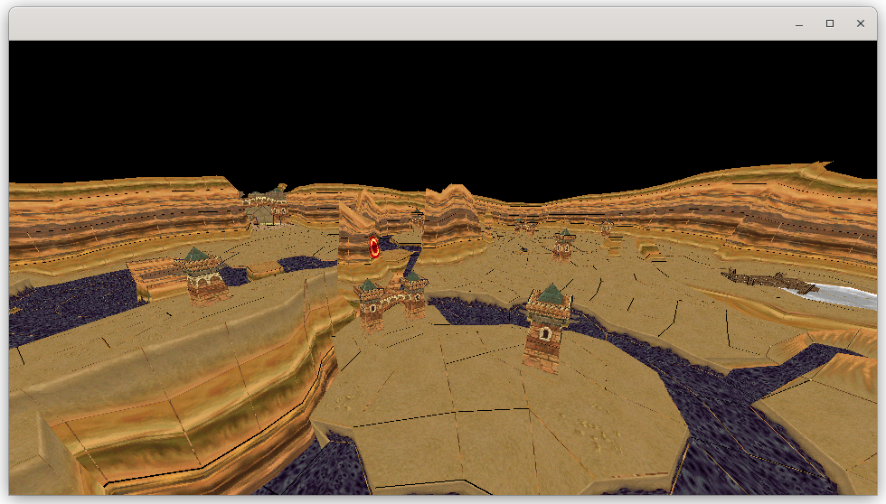

# 👋 Welcome to **Quoruda's** profile!

💻 **Computer Science student** | 🌱 **Creator of projects from scratch** | 🤝 **Open-source supporter**

---

## 👤 About me

I am currently studying computer science and I love building projects from the ground up. Here, you'll find my projects, created to share ideas, collaborate with other developers, and contribute to the open-source ecosystem. My goal is to combine creativity, learning, and visibility in the world of development.

Feel free to explore my repositories, ask questions, or collaborate on a project! 🚀

<!--
---

📢 **Also find me here:**  
- [Mail](#)  
- [Personal Portfolio](#)
-->
# 📊 GitHub Stats:

 

## 📂 Projects 

### [ 🦀 Krab Language (2024)](https://github.com/Quoruda/KrabLanguage)
Krab is a minimalist programming language designed as a personal challenge. It is an interpreter written in Rust, inspired by Rust's mascot.

	

### [ :video_game: 3D Engine (2024)](https://github.com/Quoruda/3D-Engine)
3D-Engine is a minimalist 3D rendering engine built from scratch in Java. It supports importing .obj models, manipulating them (scale, rotation, position), and applying textures using UV mapping. Fully CPU-based, this project explores the fundamentals of graphics rendering without relying on a GPU.

	

### [ 👁️ Game of life (2024)](https://github.com/Quoruda/GameOfLife)
Thi is a Java project that recreates Conway's Game of Life. With support for .lif files, you can load predesigned structures or experiment with your own configurations to visualize the evolution of cellular automata.

	

<!--
## [ 📋 Algorithm ToolBox](https://github.com/Quoruda/AlgorithmToolbox)
In this repository, I  implement algorithms that will serve as modular building blocks for easy reuse in various projects.

## [ 🚀 NEATcraft Racing](https://github.com/Quoruda/NEATcraft-Racing)
-->

<!--
**Quoruda/Quoruda** is a ✨ _special_ ✨ repository because its `README.md` (this file) appears on your GitHub profile.

Here are some ideas to get you started:

- 🔭 I’m currently working on ...
- 🌱 I’m currently learning ...
- 👯 I’m looking to collaborate on ...
- 🤔 I’m looking for help with ...
- 💬 Ask me about ...
- 📫 How to reach me: ...
- 😄 Pronouns: ...
- ⚡ Fun fact: ...
-->
