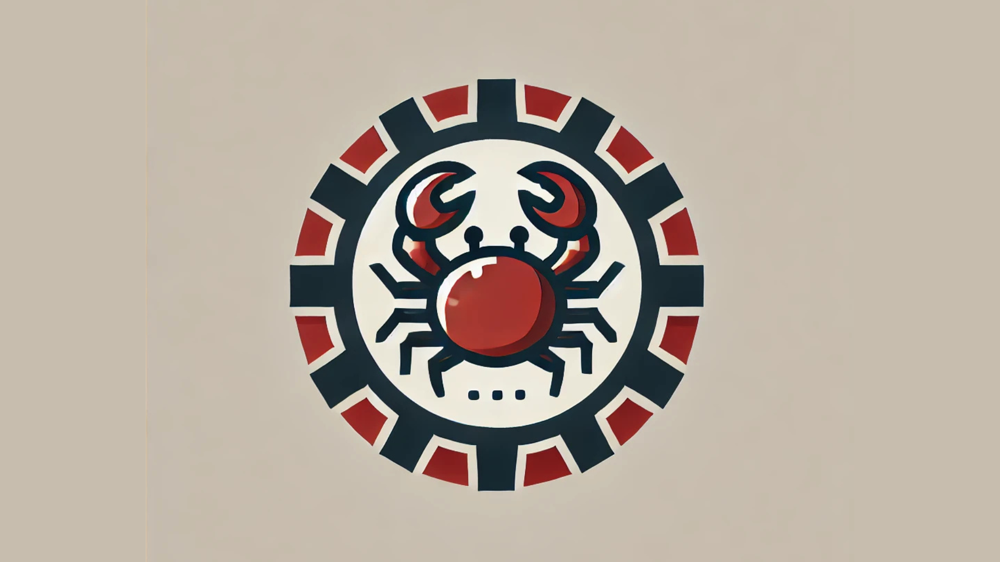
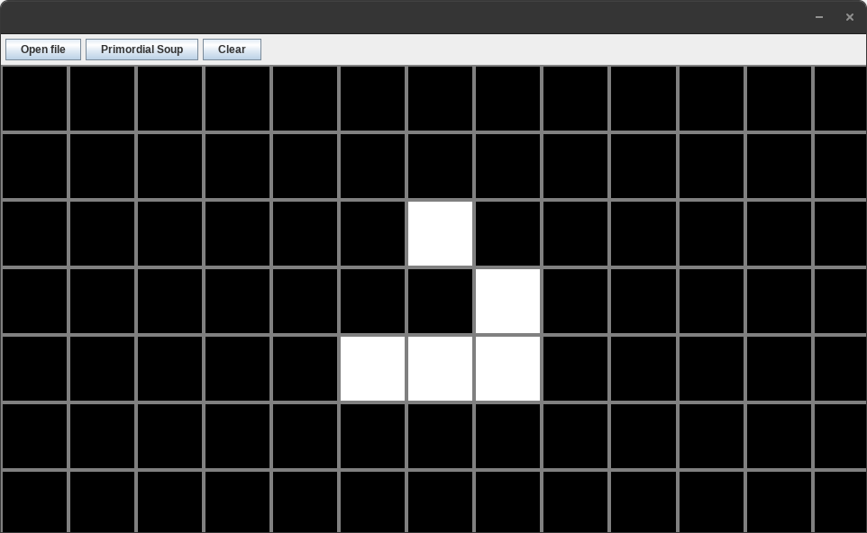

# 👋 Welcome to **Quoruda's** profile!

💻 **Computer Science student** | 🌱 **Creator of projects from scratch** | 🤝 **Open-source supporter**

---

## 👤 About me

I am currently studying computer science and I love building projects from the ground up. Here, you'll find my projects, created to share ideas, collaborate with other developers, and contribute to the open-source ecosystem. My goal is to combine creativity, learning, and visibility in the world of development.
<!--
---

📢 **Also find me here:**  
- [LinkedIn](#)  
- [Twitter](#)  
- [Personal Portfolio](#)
-->

Feel free to explore my repositories, ask questions, or collaborate on a project! 🚀

## 📂 Projects 

### [ 🦀 Krab Language](https://github.com/Quoruda/KrabLanguage)
Krab is a minimalist programming language designed as a personal challenge. It is an interpreter written in Rust, inspired by Rust's mascot. Simplicity, flexibility, and minimalism are the guiding principles!

	

### [ 👁️ Game of life](https://github.com/Quoruda/GameOfLife)
A simple implementation of the Game of Life in Java following the MVC pattern.

	

### [ :video_game: 3D Engine](https://github.com/Quoruda/3D-Engine)
This project is a 3D rendering engine in Java using only the CPU.

	

<!--
## [ 📋 Algorithm ToolBox](https://github.com/Quoruda/AlgorithmToolbox)
In this repository, I  implement algorithms that will serve as modular building blocks for easy reuse in various projects.

## [ 🚀 NEATcraft Racing](https://github.com/Quoruda/NEATcraft-Racing)
-->

<!--
**Quoruda/Quoruda** is a ✨ _special_ ✨ repository because its `README.md` (this file) appears on your GitHub profile.

Here are some ideas to get you started:

- 🔭 I’m currently working on ...
- 🌱 I’m currently learning ...
- 👯 I’m looking to collaborate on ...
- 🤔 I’m looking for help with ...
- 💬 Ask me about ...
- 📫 How to reach me: ...
- 😄 Pronouns: ...
- ⚡ Fun fact: ...
-->
